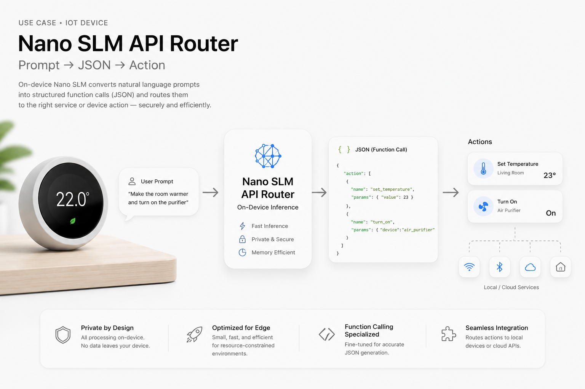

# Fast Nano SLMs (Fine-Tuning & Optimization)

**Main Goal:** Optimizing Inference and Memory Efficiency for Function-calling tasks (fine-tuning) in private/resource-constrained environments.



*Image generated with GPT Image 2 to demonstrate the core idea of Nano SLM function-calling models.*

**Current SOTA Model:** [FunctionGemma 270M by Google DeepMind](https://deepmind.google/models/gemma/functiongemma/) is an open model specialized for function calling at the edge.

## Setup (free)

*All experiments were conducted using freely available and accessible resources, ensuring that experiments will be reproducable without any extra-costs.*

* Hardware: `NVIDIA Tesla T4 (VRAM 16GB)`
* Environment: `Google Colab / Kaggle Notebooks`

## Dataset

[Salesforce/xlam-function-calling-60k dataset](https://huggingface.co/datasets/Salesforce/xlam-function-calling-60k) - 60,000 data collected by APIGen, an automated data generation pipeline designed to produce verifiable high-quality datasets for function-calling applications. 

### Data Splitting

*We used only 10k samples out of the 60k-sample dataset to mitigate out-of-memory issues and accelerate training and evaluation experiments. Additionally, for fine-tuning sub-1B models, we required only a relatively small amount of data for adaptation and instruction-following through lightweight fine-tuning, rather than aggressive full fine-tuning.*

Data Splitting Notebook: [notebooks/Data_Splitting_Nano_SLMs_Function_Calling_Salesforce.ipynb](notebooks/Data_Splitting_Nano_SLMs_Function_Calling_Salesforce.ipynb)

| Set | Samples |
| ---  | ---     |
| Test | 1,000 (~10%) |  
| SFT Train | 9,000 (~90%) |
| **Total** | 10,000 |

## Metrics

*Estimated during the final evaluation inference stage of the fine-tuned model.*

### Accuracy

| Metric              | Description                                                                        |
| ------------------- | ---------------------------------------------------------------------------------- |
| json_valid_pct      | Percentage of outputs that are valid JSON                                          |
| name_match_pct      | Percentage of predictions where the function/tool name matches the expected target |
| args_keys_match_pct | Percentage of predictions where argument keys match the reference keys             |
| args_exact_pct      | Percentage of predictions with an exact argument match                             |

### Performance

| Metric                     | Description                                        |
| -------------------------- | -------------------------------------------------- |
| wall_total_s               | Total wall-clock execution time in seconds         |
| avg_latency_s              | Average end-to-end latency per sample              |
| p95_latency_s              | 95th percentile latency                            |
| avg_ttft_s                 | Average time-to-first-token                        |
| avg_tokens_per_sec         | Average generation throughput in tokens per second |
| avg_tokens_generated       | Average number of generated tokens per sample      |
| avg_vram_delta_mb          | Average GPU VRAM usage increase in MB              |
| peak_vram_reserved_mb      | Peak reserved GPU VRAM during inference in MB      |
| avg_ram_delta_mb           | Average system RAM usage increase in MB            |
| avg_cpu_percent            | Average CPU utilization percentage                 |
| throughput_samples_per_sec | Processed samples per second                       |

### CO₂ / Energy

| Metric       | Description                                |
| ------------ | ------------------------------------------ |
| emissions_kg | Estimated total CO₂ emissions in kilograms |
| emissions_g  | Estimated total CO₂ emissions in grams     |

## Nano Function Calling Master SLMs Zoo

Lightweight function-calling models fine-tuned using `LoRA SFT (full-precision)` based on the `Salesforce/xlam-function-calling-60k dataset`

| No. | Base model | Fine-tuned HF Model Link | supported languages | repo files size | `note` | `name_match_pct` | `args_keys_match_pct` | `args_exact_pct` | `notebook` |
| --- | --- | --- | --- | --- | --- | --- | --- | --- | --- | 
| 1 | [Qwen/Qwen2.5-0.5B-Instruct](https://huggingface.co/Qwen/Qwen2.5-0.5B-Instruct) | [silvermete0r/qwen2.5-nano-function-master](https://huggingface.co/silvermete0r/qwen2.5-nano-function-master) | ~29 | 1GB | `fine-tuned` | `96.4%` | `87.9%` | `77.7%` | [notebook-link](notebooks/SLM_Qwen2_5_0_5B_Fine_Tuning_for_Function_Calling_Tasks.ipynb) |
| 2 | [Qwen/Qwen3-0.6B](https://huggingface.co/Qwen/Qwen3-0.6B) | *Don't need fine-tuning, already 100% exact match rates, base model -> without any fine-tuning -> Impressive!* | 100+ | 1.52GB | `base (no-fine-tune)` | `100.0%` | `100.0%` | `100.0%` | [notebook-link](notebooks/SLM_Qwen3_0_0_6B_Batch_Inference_Testing_Function_Calling_Tasks.ipynb) |
| 3 | [HuggingFaceTB/SmolLM2-135M-Instruct](https://huggingface.co/HuggingFaceTB/SmolLM2-135M-Instruct) | `...` | *release will be soon..* | primarily for English | ~1.97GB | `` | `` | `` | `` |
| 4 | [google/gemma-3-270m-it](https://huggingface.co/google/gemma-3-270m-it) | `...` | *release will be soon..*  | 140+ | 575MB | `` | `` | `` | `` |

*Benchmarking the current SOTA model for function-calling based on our testing set (~1000 samples):*

| model | languages support | repo files size | `name_match_pct` | `args_keys_match_pct` | `args_exact_pct` | inference-notebook | 
| --- | --- | --- | --- | --- | --- | --- | 
| [hf:google/functiongemma-270m-it](https://huggingface.co/google/functiongemma-270m-it) + [kaggle:google/functiongemma](https://www.kaggle.com/models/google/functiongemma/) | 140+ | 864MB | `95.6%` | `80.1%` | `59.1%` | [functiongemma-test-sf-60k-function-calling-1k](https://www.kaggle.com/code/armanzhalgasbayev/functiongemma-test-sf-60k-function-calling-1k) |

> FunctionGemma requires additional fine-tuning for specific tasks and, by default, produces outputs using a set of specialized formatting control tokens defined in the official documentation: https://ai.google.dev/gemma/docs/functiongemma/formatting-and-best-practices

> We have implemented a custom `functiongemma -> json xlam-60k format` converter, and it does not always work reliably across all cases. So, it is important to emphasize that this is not a benchmark or a meaningful accuracy evaluation, since the model was not fine-tuned for tasks like in this dataset (probably).

> Nevertheless, the results of the functiongemma are impressive, showing almost 59.1% accuracy in the overall answers. As function calling is the core specialization of the model, FunctionGemma already outperforms non-fine-tuned base SLMs on function-calling tasks. 

## Relevant Resources

1. Responsible Generative AI Toolkit: Tools and guidance to design, build and evaluate open AI models responsibly. https://ai.google.dev/responsible
2. Google’s Secure AI Framework (SAIF): https://safety.google/safety/saif/
3. No-Code Fine-tuning web platform for gemma-270m: https://huggingface.co/spaces/google/functiongemma-tuning-lab

## Competitions

1. [Build Small Hackathon by Gradio & HuggingFace 🤗](https://huggingface.co/build-small-hackathon)

## References

This project uses data derived from the Salesforce xLAM Function Calling 60k dataset: https://huggingface.co/datasets/Salesforce/xlam-function-calling-60k | Licensed under CC BY 4.0: https://creativecommons.org/licenses/by/4.0/

```
@article{liu2024apigen,
  title={APIGen: Automated Pipeline for Generating Verifiable and Diverse Function-Calling Datasets},
  author={Liu, Zuxin and Hoang, Thai and Zhang, Jianguo and Zhu, Ming and Lan, Tian and Kokane, Shirley and Tan, Juntao and Yao, Weiran and Liu, Zhiwei and Feng, Yihao and others},
  journal={arXiv preprint arXiv:2406.18518},
  year={2024}
}
```